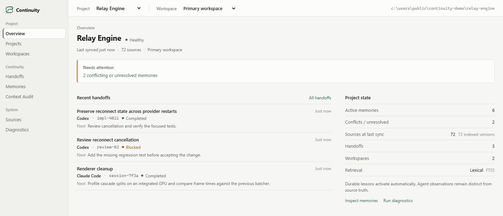

<p align="center">
  <picture>
    <source media="(prefers-color-scheme: dark)" srcset="docs/branding/continuity-readme-banner-dark.png">
    <source media="(prefers-color-scheme: light)" srcset="docs/branding/continuity-readme-banner-light.png">
    
  </picture>
</p>

<p align="center">
  <a href="https://github.com/cubiix3/continuity/actions/workflows/ci.yml"></a>
  <a href="https://github.com/cubiix3/continuity/releases/tag/v0.1.0"></a>
  <a href="LICENSE"></a>
  
</p>

Continuity is a local continuity layer. It keeps project identity, memory,
provenance and structured handoffs stable while agents and sessions change.
Git and your project files stay the source of truth.



<sub>The local Dashboard with a demo project. No hosted service, account or model key.</sub>

## Why Continuity

You switch from Claude Code to Codex, start a fresh session, or hand work to
another agent. The agent changes. The project does not.

Without a shared layer, every new session rediscovers the same rules, repeats the
same decisions and loses what the last agent was halfway through. Continuity keeps
that state with the project, not with a chat:

```text
   Claude Code ──┐                       ┌──▶ Codex
                 ▼                       │
            ┌────────────────────────────┴───┐
            │           Continuity           │
            │  identity · memory · handoffs  │
            │   provenance · context audit   │
            └────────────────────────────────┘
                 ▲                       │
   CLI / MCP ────┘                       └──▶ the next session
```

| Continuity is | Continuity is not |
| --- | --- |
| Local project continuity across agents and sessions | Another coding agent or an IDE |
| Durable project memory with provenance and conflict quarantine | A chat archive or transcript store |
| Structured handoffs between agents | A replacement for Git |
| Project and workspace isolation | A cloud memory service |
| A CLI, MCP server and loopback API | A replacement for native Read, Grep or Git tools |

## What it keeps

| | |
| --- | --- |
| **Project identity** | A local ID bound to the canonical project directory, independent of display name, agent or session. |
| **Workspaces** | Git worktrees share one project identity but keep separate current sources. |
| **Memory** | Source-backed facts and attributed agent lessons, each with its origin and trust level. |
| **Handoffs** | Goal, completed and remaining work, decisions, risks, changed files and the next action. |
| **Provenance** | Source paths, SHA-256 versions and capture times behind every context item. |
| **Context audit** | Which sources and memories were selected for a context bundle, and why others were excluded. |

## How it works

1. `continuity init` registers a project. `continuity sync` builds a bounded,
   hashed index of its current text sources.
2. Agents connect through MCP, the CLI or the local API. The host fixes the
   project, so an agent can read and write only that project's state.
3. Agents propose memories and leave handoffs. Core policy decides what becomes
   durable, at which trust level, and what is quarantined.
4. Context requests return a byte-budgeted bundle with provenance and an
   explanation. Changed or deleted sources can no longer support old claims.

### Memory model

- **Source-backed facts** are checked against the current file and keep its path and hash.
- **Attributed agent lessons** activate automatically at a lower `agent_observation` trust.
- **Conflicts** are quarantined instead of resolved by whichever write came last.
- **Current sources outrank agent observations.** Routine execution noise is rejected.
- **Human review is optional**: an explicit override, not a queue you must work through.

See the [memory model](docs/memory-model.md). Automatic memory is on `main` and
not yet part of a release; v0.1.0 uses explicit review for free-form memory.

## Quickstart

Requirements: **Node.js 24.13 or newer** on the Node 24 line, and Git.
Continuity is not published to the npm registry. Do not install an unrelated
package named `continuity`.

**Latest release (v0.1.0).** Download `continuity-local-0.1.0.tgz` from the
[release page](https://github.com/cubiix3/continuity/releases/tag/v0.1.0), then:

```sh
npm install --global ./continuity-local-0.1.0.tgz
```

**Current `main`** (includes the unreleased changes listed under
[Status](#status)). Requires pnpm 10.30.1:

```sh
git clone https://github.com/cubiix3/continuity.git
cd continuity
pnpm install --frozen-lockfile
pnpm check
pnpm link --global
```

If pnpm's global bin directory is not configured, run `pnpm setup` and open a new
terminal. Without linking, `pnpm continuity --project <path> init` works from the checkout.

Then, inside your project:

```sh
continuity init
continuity sync
continuity dashboard
```

Open <http://127.0.0.1:4783>. The browser does not open automatically.

Leave a handoff and pick it up in another agent's session:

```sh
continuity handoff create --file handoff.json
# later, from another agent in the same project:
continuity handoff latest
```

The [runnable example](examples/README.md) covers memory and handoff inputs.

## Agent integrations

| Integration | Status |
| --- | --- |
| Claude Code | Verified on Windows 2.1.278 · [setup](docs/integrations/claude-code.md) |
| Codex | Verified on Windows CLI 0.155.1 · [setup and sandbox notes](docs/integrations/codex.md) |
| MCP stdio | Six project-bound tools, tested with the official SDK client and real agents |
| CLI and TypeScript host API | Implemented and integration-tested |
| Local HTTP v1 | Loopback only; token, origin and scope boundaries tested |
| RIVET | Experimental draft/shadow integration; RIVET's own state remains authoritative |
| Command Code, Grok | Unverified; Grok structured results remain unresolved |
| Ollama, OpenViking | Optional local semantic retrieval · [tested versions and limits](docs/retrieval.md) |

A [real cross-agent fixture](docs/integrations/cross-agent.md) passes structured
work between fresh Claude Code and Codex sessions without sharing transcripts.
See [adapter contracts](docs/adapters.md).

## Dashboard

`continuity dashboard` serves a local, read-mostly view on `127.0.0.1`:
Overview, Projects, Workspaces, Handoffs, Memories, Context Audit, Sources and
Diagnostics. It shows project health, recent handoffs, memory origins and
conflicts, source freshness and historical context selection. Writes are limited
to explicit memory actions and workspace sync. See [Dashboard operation and security](docs/dashboard.md).

## Local-first and security

- **Local by default.** State lives in a local SQLite database outside your
  repository. No cloud service, account, model key or telemetry.
- **Loopback only.** The Dashboard and HTTP API bind to `127.0.0.1`. Every HTTP API
  request needs a bearer token; the Dashboard adds same-origin checks, a restrictive
  CSP and a per-session capability for writes.
- **Project isolation.** MCP and HTTP clients cannot select another project;
  cross-project retrieval is denied.
- **Untrusted source text.** Repository content is data, never permission to
  change Continuity policy.
- **Bounded sources.** Symlinks, hard links, nested repositories, secret files and
  recognizable credentials are excluded; source text is hashed and re-checked.
- **Not encrypted.** Local state is not encrypted at rest. Secret detection is heuristic.

Read the [security model](docs/security.md) before indexing sensitive projects,
and [SECURITY.md](SECURITY.md) to report a vulnerability.

## Large projects

Large repositories can keep one stable project identity while narrowing
Continuity's local source index with `continuity sources set --include ... --exclude ...`.
The filter lives in local state, never in the repository. See [source scope](docs/source-scope.md).
This is on `main` and not yet part of a release.

## Architecture

```text
      CLI · Dashboard · MCP · local HTTP · TypeScript host API
                              │
                   project-bound Core client
                              │
       identity · namespace guard · memory policy · handoffs
            retrieval · budgeting · provenance · audit
                              │
                         storage ports
                     ┌────────┴─────────┐
               SQLite + FTS5     filesystem sources
```

Policy lives in the Core. Adapters receive a scoped capability, never database
access. FTS5 retrieval works fully offline; semantic retrieval is optional and
[not consistently better](docs/retrieval-evaluation.md).

## Commands

```text
init                          Register the current directory
status | doctor               Identity and last sync | storage and registration health
sync                          Refresh the source index
sources show | preview        Current source scope | read-only selection and limit check (main)
sources set | clear           Replace or remove this project's local source filter (main)
search <query>                Current source excerpts
context <task>                Build a byte-budgeted context bundle
inspect | explain <id>        Read a historical bundle | explain its selection
memory list | show <id>       Inspect memories
memory remember <text>        Record with --key and --source (--agent/--session on main)
memory forget <id>            Deactivate; revision history is kept (main)
memory pending                Candidates awaiting review and unresolved conflicts
memory approve | reject <id>  Human review with --by <reviewer>
handoff create --file <path>  Save structured JSON (use - for stdin)
handoff latest | show <id>    Retrieve a handoff
project list | status         Inspect local registrations
project rebind <id>           Explicit move with --from and --to
retention status              Retention classes and eligibility
prune --dry-run               Preview only; never deletes
mcp                           Serve project-bound tools over stdio
serve                         Local authenticated HTTP API on 127.0.0.1
dashboard                     Local Dashboard on 127.0.0.1:4783
```

Commands marked (main) are not in v0.1.0. Global flags: `--project <directory>`, `--home <directory>`, `--json`.
`CONTINUITY_HOME` overrides the default `~/.continuity` state directory.

## Documentation

- [Architecture](docs/architecture.md) and [decision records](docs/adr/README.md)
- [Memory model](docs/memory-model.md) · [Handoffs](docs/handoffs.md) · [Source scope](docs/source-scope.md)
- [Dashboard](docs/dashboard.md) · [Adapters, MCP and HTTP](docs/adapters.md) · [Retrieval](docs/retrieval.md)
- [Security model](docs/security.md) · [Operations](docs/operations.md) · [Product scope](docs/product-scope.md)
- [Brand assets](docs/branding/README.md)

## Status

**Latest release:** [v0.1.0](https://github.com/cubiix3/continuity/releases/tag/v0.1.0).
Project identity, workspaces, handoffs, reviewed memory, provenance, context
audit, MCP, local HTTP and the Dashboard.

**Current `main` (unreleased):** automatic-first durable memory, local per-project
source scope, a refreshed and denser Dashboard, and the new brand mark. See the
[changelog](CHANGELOG.md).

**Next:** a background runtime with Windows sign-in startup and automatic sync is
under validation in a draft pull request. Provider-neutral agent bootstrap and
future release packaging follow. Agent orchestration, cloud sync and a RIVET
cutover are out of scope; the [RIVET dogfood notes](docs/research/rivet-dogfood.md)
record what was and was not proven.

## Development

```sh
pnpm check          # build, strict typecheck, tests, lint
pnpm exec playwright install chromium
pnpm test:ui        # Dashboard browser tests
pnpm test:pack      # install the packed tarball into a fresh project
```

CI runs these on Linux and Windows. Read [CONTRIBUTING.md](CONTRIBUTING.md) and
[AGENTS.md](AGENTS.md) before changing Core boundaries. See
[operations](docs/operations.md) for rebind, review and retention previews.

## License

[Apache-2.0](LICENSE).
