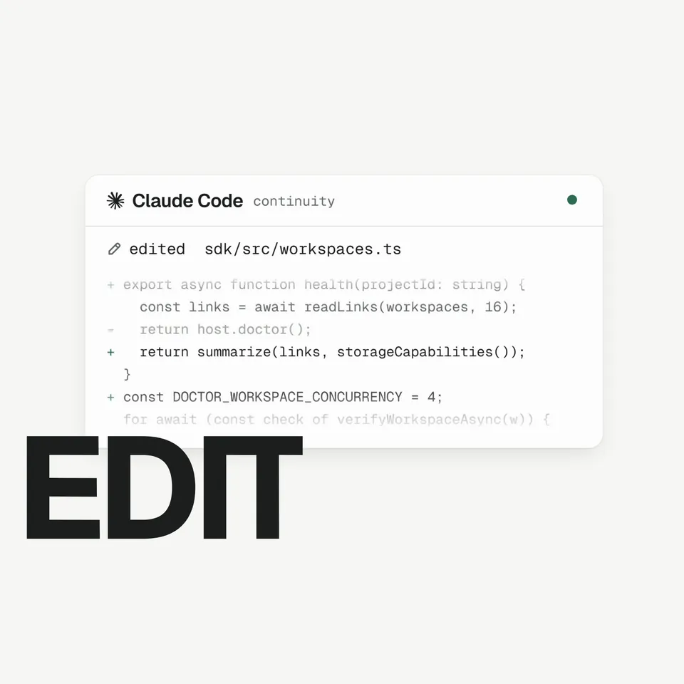
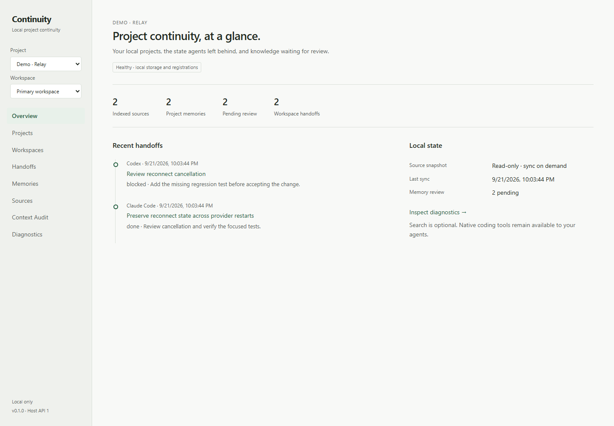

<p align="center">
  <picture>
    <source media="(prefers-color-scheme: dark)" srcset="docs/branding/continuity-readme-banner-dark.png">
    <source media="(prefers-color-scheme: light)" srcset="docs/branding/continuity-readme-banner-light.png">
    
  </picture>
</p>

<p align="center">
  <a href="https://github.com/cubiix3/continuity/actions/workflows/ci.yml"></a>
  <a href="https://github.com/cubiix3/continuity/releases/tag/v0.2.0"></a>
  <a href="LICENSE"></a>
  
</p>

<h3 align="center">Agents are replaceable. Project continuity is not.</h3>

Continuity is a local-first project continuity layer for AI coding agents.
Claude Code can work on a project and leave a durable lesson or a handoff, and
Codex can continue from the same project context in a fresh session, without
sharing transcripts. Git and your project files stay the source of truth.

<p align="center">
  <a href="#quickstart"><b>Get started</b></a> ·
  <a href="#dashboard">Dashboard</a> ·
  <a href="#how-it-works">How it works</a> ·
  <a href="https://github.com/cubiix3/continuity/releases/tag/v0.2.0">v0.2.0 release</a> ·
  <a href="#documentation">Docs</a> ·
  <a href="https://cubiix3.github.io/continuity/">Website</a>
</p>

## See it in 30 seconds

<p align="center">
  <picture>
    <source media="(prefers-reduced-motion: reduce)" srcset="site/assets/continuity-demo-still.webp">
    
  </picture>
</p>

1. **Claude Code learns a project-specific lesson**: on Windows, removing a pnpm
   worktree with Git fails, `fs.rmSync` works.
2. **Continuity keeps it** as a durable lesson of this project, attributed to
   Claude Code at `agent_observation` trust.
3. **A fresh Codex session receives it automatically** in its startup context,
   before the first prompt. No transcript crosses sessions, only the lesson and its origin.

<sub>Animated walkthrough. The lesson, key and trust label come from a real, isolated
Continuity install; the Codex line shows the lesson's content, not a captured transcript.</sub>

## Why Continuity

You switch from Claude Code to Codex, start a fresh session, or hand work to
another agent. The agent changes. The project does not.

```text
Without Continuity
  Claude Code ── learns the project's rules and fixes ──▶ session ends
  Codex       ── fresh session ──▶ rediscovers the same rules, repeats the same fix

With Continuity
  Claude Code ── lesson · handoff ──▶ Continuity ──▶ Codex, fresh session
                                      local · project-bound · with provenance
```

Continuity keeps that state with the project, not with a chat.

| Continuity is | Continuity is not |
| --- | --- |
| Local project continuity across agents and sessions | Another coding agent or an IDE |
| Durable project memory with provenance and conflict quarantine | A chat archive or transcript store |
| Structured handoffs between agents | A replacement for Git |
| Project and workspace isolation | A cloud memory service |
| A CLI, MCP server and loopback API | A replacement for native Read, Grep or Git tools |

## After setup, just work

```text
cd my-project
claude        # or: codex
```

After a one-time [setup](#quickstart), a normal Claude Code or Codex session needs
no Continuity commands:

- **At session start** the agent receives the project's startup context: health,
  the latest open handoff and durable memories with their trust labels.
- **After a turn that edited files**, an interactive session saves up to three
  durable lessons and, if work is unfinished, a handoff. Continuity's memory policy
  decides what is kept. No chats are read. Scripted `claude -p` and `codex exec`
  answers stay unchanged.
- **The next session**, with the same agent or the other one, starts from there
  and can close the handoff once the work is done.

Details are in [agent bootstrap](docs/agent-bootstrap.md) and
[agent lifecycle](docs/agent-lifecycle.md).

## Quickstart

Requirements: **Node.js 24.13 or newer** on the Node 24 line, and Git.
See [stability boundaries](STABILITY.md) and [upgrade steps](UPGRADING.md) before replacing a local installation.
Continuity is not published to the npm registry. Do not install an unrelated
package named `continuity`.

**Latest release (v0.2.0).** Download `continuity-local-0.2.0.tgz` from the
[release page](https://github.com/cubiix3/continuity/releases/tag/v0.2.0), then:

```sh
npm install --global ./continuity-local-0.2.0.tgz
```

Register a project once, from inside it:

```sh
continuity init
continuity sync
```

Then install a provider integration once:

```sh
continuity integrate claude install
continuity integrate codex install
```

Codex runs user hooks only after a one-time review: open Codex and trust the
Continuity hook in `/hooks`. See [agent bootstrap](docs/agent-bootstrap.md) for
`status`, `remove`, `--no-autosave` and `--no-mcp`.

Open the local Dashboard with `continuity dashboard` at <http://127.0.0.1:4783>.
The browser does not open automatically.

On Windows, v0.2.0 can keep the Dashboard running and sync projects
automatically after sign-in: `continuity startup install`, then `continuity runtime start`
to start it now. It runs as the current user, without administrator rights. See the
[background runtime](docs/background-runtime.md) for limits and removal.

Other agents and scripts can leave and pick up handoffs through the CLI or MCP:

```sh
continuity handoff create --file handoff.json
# later, from another agent in the same project:
continuity handoff latest
```

The [runnable example](https://github.com/cubiix3/continuity/blob/v0.2.0/examples/README.md) covers memory and handoff inputs.

**From source** (for contributors). Requires pnpm 10.30.1:

```sh
git clone https://github.com/cubiix3/continuity.git
cd continuity
pnpm install --frozen-lockfile
pnpm check
pnpm link --global
```

If pnpm's global bin directory is not configured, run `pnpm setup` and open a new
terminal. Without linking, `pnpm continuity --project <path> init` works from the checkout.

## What it keeps

| | |
| --- | --- |
| **Project identity** | A local ID bound to the canonical project directory, independent of display name, agent or session. |
| **Workspaces** | Git worktrees share one project identity but keep separate current sources. |
| **Memory** | Source-backed facts and attributed agent lessons, each with its origin and trust level. |
| **Handoffs** | Goal, completed and remaining work, decisions, risks, changed files and the next action. |
| **Provenance** | Source paths, SHA-256 versions and capture times behind every context item. |
| **Context audit** | Which sources and memories were selected for a context bundle, and why others were excluded. |

## How it works

1. `continuity init` registers a project. `continuity sync` builds a bounded,
   hashed index of its current text sources.
2. Agents connect through provider hooks, MCP, the CLI or the local API. The host
   fixes the project, so an agent can read and write only that project's state.
3. Agents propose memories and leave handoffs. Core policy decides what becomes
   durable, at which trust level, and what is quarantined.
4. Context requests return a byte-budgeted bundle with provenance and an
   explanation. Changed or deleted sources can no longer support old claims.

### Memory model

- **Source-backed facts** are checked against the current file and keep its path and hash.
- **Attributed agent lessons** activate automatically at a lower `agent_observation` trust.
- **Conflicts** are quarantined instead of resolved by whichever write came last.
- **Current sources outrank agent observations.** Routine execution noise is rejected.
- **Human review is optional**: an explicit override, not a queue you must work through.

See the [memory model](docs/memory-model.md). Automatic memory is included in
v0.2.0; explicit human review remains available.

## Agent integrations

| Integration | Status |
| --- | --- |
| Claude Code | Verified on Windows 2.1.278; automatic startup context verified on 2.1.280 · [setup](docs/integrations/claude-code.md) |
| Codex | Verified on Windows CLI 0.155.1; automatic startup context verified on 0.156.1; interactive autosave verified on 0.157.0 · [setup and sandbox notes](docs/integrations/codex.md) |
| MCP stdio | Seven project-bound tools, tested with the official SDK client and real agents |
| CLI and TypeScript host API | Implemented and integration-tested |
| Local HTTP v1 | Loopback only; token, origin and scope boundaries tested |
| RIVET | Experimental draft/shadow integration; RIVET's own state remains authoritative |
| Command Code, Grok | Unverified; Grok structured results remain unresolved |
| Ollama, OpenViking | Optional local semantic retrieval · [tested versions and limits](docs/retrieval.md) |

Claude Code and Codex are the first-class tested integrations. A
[real cross-agent fixture](docs/integrations/cross-agent.md) passes structured
work between fresh Claude Code and Codex sessions without sharing transcripts.
See [adapter contracts](docs/adapters.md).

## Dashboard



<sub>The local Dashboard with a demo project. No hosted service, account or model key.</sub>

`continuity dashboard` serves a local, read-mostly view on `127.0.0.1`:
Overview, Projects, Workspaces, Handoffs, Memories, Context Audit, Sources and
Diagnostics. It shows project health, recent handoffs, memory origins and
conflicts, source freshness and historical context selection. Writes are limited
to explicit memory actions and workspace sync. See [Dashboard operation and security](docs/dashboard.md).

## Local-first and security

- **Local by default.** State lives in a local SQLite database outside your
  repository. No cloud service, account, model key or telemetry.
- **Loopback only.** The Dashboard and HTTP API bind to `127.0.0.1`. Every HTTP API
  request needs a bearer token; the Dashboard adds same-origin checks, a restrictive
  CSP and a per-session capability for writes.
- **Project isolation.** MCP and HTTP clients cannot select another project;
  cross-project retrieval is denied.
- **Untrusted source text.** Repository content is data, never permission to
  change Continuity policy.
- **Bounded sources.** Symlinks, hard links, nested repositories, secret files and
  recognizable credentials are excluded; source text is hashed and re-checked.
- **Not encrypted.** Local state is not encrypted at rest. Secret detection is heuristic.

Read the [security model](docs/security.md) before indexing sensitive projects,
and [SECURITY.md](SECURITY.md) to report a vulnerability.

## Large projects

Large repositories can keep one stable project identity while narrowing
Continuity's local source index with `continuity sources set --include ... --exclude ...`.
The filter lives in local state, never in the repository. See [source scope](docs/source-scope.md).
Source scope is included in v0.2.0.

## Architecture

```text
      CLI · Dashboard · MCP · local HTTP · TypeScript host API
                              │
                   project-bound Core client
                              │
       identity · namespace guard · memory policy · handoffs
            retrieval · budgeting · provenance · audit
                              │
                         storage ports
                     ┌────────┴─────────┐
               SQLite + FTS5     filesystem sources
```

Policy lives in the Core. Adapters receive a scoped capability, never database
access. FTS5 retrieval works fully offline; semantic retrieval is optional and
[not consistently better](docs/retrieval-evaluation.md).

## Commands

```text
init                          Register the current directory
status | doctor               Identity and last sync | storage, registration, runtime and integration health
sync                          Refresh the source index
sources show | preview        Current source scope | read-only selection and limit check
sources set | clear           Replace or remove this project's local source filter
search <query>                Current source excerpts
context <task>                Build a byte-budgeted context bundle
inspect | explain <id>        Read a historical bundle | explain its selection
memory list | show <id>       Inspect memories
memory remember <text>        Record with --key and --source; --agent/--session for agent lessons
memory forget <id>            Deactivate; revision history is kept
memory pending                Candidates awaiting review and unresolved conflicts
memory approve | reject <id>  Human review with --by <reviewer>
handoff create --file <path>  Save structured JSON (use - for stdin)
handoff latest | show <id>    Retrieve a handoff
handoff close <id>            Mark a handoff finished (kept as history)
bootstrap                     Read-only startup index for agent sessions
integrate claude|codex        Provider startup, autosave hooks and detail tools: install | status | remove
project list | status         Inspect local registrations
project rebind <id>           Explicit move with --from and --to
retention status              Retention classes and eligibility
prune --dry-run               Preview only; never deletes
mcp                           Serve project-bound tools over stdio
serve                         Local authenticated HTTP API on 127.0.0.1
dashboard                     Local Dashboard on 127.0.0.1:4783
runtime start | status | stop Background Dashboard and automatic sync
startup install | remove      Windows current-user sign-in startup; also status
```

Global flags: `--project <directory>`, `--home <directory>`, `--json`.
`CONTINUITY_HOME` overrides the default `~/.continuity` state directory.

## Documentation

- [Architecture](docs/architecture.md) and [decision records](docs/adr/README.md)
- [Memory model](docs/memory-model.md) · [Handoffs](docs/handoffs.md) · [Agent bootstrap](docs/agent-bootstrap.md) · [Agent lifecycle](docs/agent-lifecycle.md) · [Source scope](docs/source-scope.md)
- [Dashboard](docs/dashboard.md) · [Background runtime](docs/background-runtime.md) · [Adapters, MCP and HTTP](docs/adapters.md) · [Retrieval](docs/retrieval.md)
- [Security model](docs/security.md) · [Operations](docs/operations.md) · [Product scope](docs/product-scope.md)
- [Stability boundaries](STABILITY.md) · [Upgrading](UPGRADING.md) · [v0.2.0 release notes](docs/releases/v0.2.0.md) · [Changelog](CHANGELOG.md)
- [Brand assets](docs/branding/README.md)

## Status

**Latest release:** [v0.2.0](https://github.com/cubiix3/continuity/releases/tag/v0.2.0).
Claude Code and Codex have tested automatic project startup context, durable
lessons and handoffs after explicit one-time integration setup. Source scope,
the optional background runtime, Windows sign-in startup, Dashboard and Doctor
are included. See the [changelog](CHANGELOG.md) and [release notes](docs/releases/v0.2.0.md).

Agent orchestration, cloud sync and a RIVET cutover remain out of scope.

## Development

```sh
pnpm check          # build, strict typecheck, tests, lint
pnpm exec playwright install chromium
pnpm test:ui        # Dashboard browser tests
pnpm test:pack      # install the packed tarball into a fresh project
```

CI runs these on Linux and Windows. Read [CONTRIBUTING.md](https://github.com/cubiix3/continuity/blob/v0.2.0/CONTRIBUTING.md) and
[AGENTS.md](https://github.com/cubiix3/continuity/blob/v0.2.0/AGENTS.md) before changing Core boundaries. See
[operations](docs/operations.md) for rebind, review and retention previews.

## License

[Apache-2.0](LICENSE).
